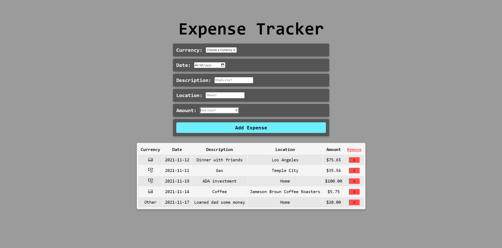

# Expense Tracker

# Overview

- Simple Expense Tracker application built entirely with HTML, CSS, and Javascript.
- Showcases several inputs for tabularly tracking your expenses.

# Website

- See it [here](https://brandonchuck.github.io/VanillaJS-Expense-Tracker/) on Github Pages! 

# Preview

# Summary

This project allowed me to work on consolidating user data into a tabular format for readability and organization. To do so, I utilized Javascript objects to store each expense detail and generate the expense row. Displaying data in a tabular fashion is a widely used technique throughout the internet and important for storage, presentation, and abstraction. After completing this project I felt comfortable creating and accessing objects and began to imagine many of the usecases. Finally, with the help of the browser, I was also able to implement a localstorage feature that allows the user to retain logged expenses even after exiting the application or refreshing the webpage. 

- Detailed Features:
    - Utilized javascript objects to store expense row data.
    - Each expense row contains remove button for deletion.
    - HTML form for submitting user data to table.
    - Local storage feature allows users to retain logged expenses.

# Author

Brandon Chuck | Full Stack Developer | [LinkedIn](https://www.linkedin.com/in/brandonchuck/) | [Personal Website](https://www.brandonchuck-dev.com)
